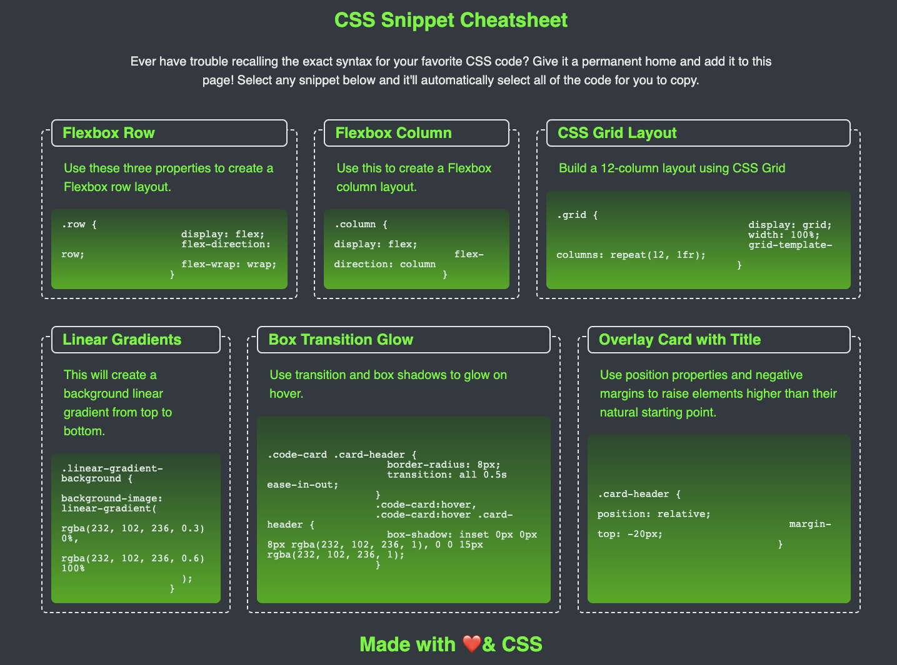

# CSS Snippet Cheatsheet

## Description

Link to deployed application
 https://itcreativeusa.github.io/CSS-snippet-cheatsheet

Github link 
https://github.com/itcreativeusa/CSS-snippet-cheatsheet

This CSS-Snippet-Cheatsheet website was created as a bootcamp everyweek student challege. This website is a HTML & CSS portfolio page. The code of this portfolio page was created from scratch.
Page contain blocks of code user may automatically select.

## Table of Contents (Optional)

- [Installation](#installation)
- [Usage](#usage)
- [Requirements](#requirements)
- [Credits](#credits)
- [License](#license)

## Installation

N/A

## Requirements

No special requirements

## Usage

Screenshot located in ``` assets/images ``` folder


   

## Credits

Matrix hex colors scheme was found here:

https://www.schemecolor.com/matrix-code-green.php

## License

Please refer to the LICENSE in the repo.


